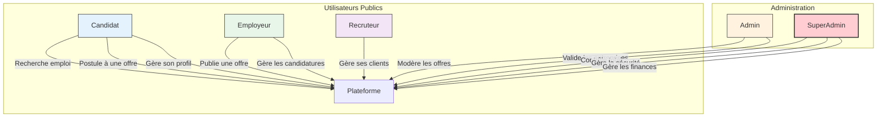

# Cahier des Charges - TRAVAIL.GA

**Version :** 1.0  
**Date :** [Date Actuelle]  
**Auteur :** Agent IA (sur la base de l'implémentation)

---

## 1. Introduction et Vision du Projet

### 1.1. Contexte
TRAVAIL.GA est une initiative stratégique visant à moderniser et centraliser le marché de l'emploi au Gabon. La plateforme a pour vocation de connecter de manière transparente et efficace les demandeurs d'emploi (candidats) avec les opportunités professionnelles offertes par les employeurs publics et privés.

### 1.2. Vision
Devenir la **plateforme nationale de référence pour l'emploi au Gabon**, en offrant un écosystème complet, sécurisé et innovant qui facilite le recrutement, promeut la transparence et soutient le développement économique du pays.

### 1.3. Objectifs Stratégiques
- **Centraliser** les offres et les demandes d'emploi sur une plateforme unique.
- **Simplifier** et accélérer le processus de recrutement pour toutes les parties.
- **Augmenter la transparence** du marché du travail gabonais.
- **Fournir des données fiables** et des statistiques sur l'emploi pour guider les politiques publiques.
- **Lutter contre la fraude** et les offres d'emploi fictives.
- **Générer des revenus** pour assurer l'autosuffisance et la pérennité de la plateforme.

---

## 2. Périmètre Fonctionnel

### 2.1. Acteurs et Rôles
La plateforme définit plusieurs rôles avec des niveaux d'accès et des fonctionnalités distincts :

| Rôle              | Description                                                                     | Interface Principale                |
|-------------------|---------------------------------------------------------------------------------|-------------------------------------|
| **Candidat**      | Cherche un emploi, postule, gère son profil et ses candidatures.                | `/travail`                          |
| **Employeur**     | Publie des offres, gère les candidatures, présente son entreprise.              | `/travail/employeur`                |
| **Recruteur**     | Gère le recrutement pour le compte de plusieurs entreprises (clients).          | `/travail/recruteur`                |
| **Administrateur**| Assure la modération quotidienne, valide les contenus, gère le support.         | `/travail/admin`                    |
| **Super Admin**   | **Contrôle total** de la plateforme : sécurité, finances, utilisateurs, système. | `/travail/super-admin`              |

### 2.2. Diagramme des Cas d'Utilisation (Simplifié)

### 2.3. Fonctionnalités Clés par Module

#### **Module Public & Candidat (`/travail`)**
- **Moteur de recherche d'emploi** avancé (mots-clés, localisation, filtres).
- **Consultation détaillée** des offres d'emploi.
- **Création et gestion de profil candidat** (CV, compétences, expérience).
- **Processus de candidature** en ligne simplifié.
- **Tableau de bord candidat** pour le suivi des candidatures.
- **Alertes email** pour les nouvelles offres correspondant au profil.
- **Annuaire des entreprises** qui recrutent.

#### **Module Employeur & Recruteur (`/travail/employeur`, `/travail/recruteur`)**
- **Tableau de bord employeur** avec statistiques.
- **Publication et gestion des offres** d'emploi.
- **Système de suivi des candidatures** (ATS léger).
- **Messagerie intégrée** pour communiquer avec les candidats.
- **Profil d'entreprise** public et personnalisable.
- **(Pour Recruteurs)** : Gestion de plusieurs pipelines de recrutement.

#### **Module Administration (`/travail/admin`)**
- **Tableau de bord de modération** (offres et entreprises en attente).
- **Validation manuelle** des nouvelles offres et des comptes entreprise.
- **Gestion des utilisateurs** de premier niveau (activation, suspension simple).
- **Accès aux rapports** d'activité de base.
- **Gestion du support** de premier niveau.

#### **Module Super Administration (`/travail/super-admin`)**
- **Tableau de bord global** avec métriques financières, techniques et d'utilisation.
- **Gestion avancée des utilisateurs** (bannissement, promotion de rôle, etc.).
- **Modération de contenu avancée** (signalements, activité suspecte).
- **Gestion financière** : configuration des frais, suivi des revenus.
- **Configuration complète du système** (mode maintenance, fonctionnalités, limites).
- **Paramètres de sécurité avancés** (2FA, détection de fraude, chiffrement).
- **Analytics et rapports détaillés** avec export de données.
- **Outils de communication de masse** (diffusion de messages).

---

## 3. Spécifications Techniques

### 3.1. Architecture Applicative
- **Framework Frontend** : Next.js (React) avec le App Router.
- **Styling** : Tailwind CSS avec la bibliothèque de composants shadcn/ui.
- **Langage** : TypeScript pour la robustesse et la maintenabilité.
- **Architecture Backend** : Logique métier dans les API Routes de Next.js.
- **Communication Client-Serveur** : API RESTful et potentiellement tRPC pour les futures optimisations.

### 3.2. Architecture de Données
- **Base de données** : PostgreSQL.
- **ORM** : Prisma pour l'accès et la gestion des données.
- **Modèles de données principaux** : `User`, `Role`, `Permission`, `Organization`, `Job`, `Application`, `DomainConfig`, `DeploymentLog`.

### 3.3. Architecture des URLs
- **Logique hiérarchique** claire et documentée (`/travail`, `/travail/admin`, `/travail/super-admin`).
- **URLs sémantiques** et intuitives pour une meilleure expérience utilisateur et un bon référencement.

### 3.4. Sécurité
- **Authentification** : Gestion par `next-auth` avec des rôles et permissions.
- **Autorisation** : Middleware pour protéger les routes en fonction des rôles.
- **Sécurité des données** : Chiffrement des données sensibles et politiques de mot de passe robustes.
- **Protection contre la fraude** : Mécanismes de détection d'activité suspecte et de modération de contenu.

### 3.5. Hébergement et Déploiement (Recommandations)
- **Hébergement** : Plateforme supportant Next.js (ex: Vercel, Netlify, AWS Amplify).
- **Base de données** : Service de base de données managé (ex: Neon, Supabase, AWS RDS).
- **CI/CD** : Pipeline de déploiement continu pour automatiser les mises en production.

---

## 4. Spécifications Non Fonctionnelles

### 4.1. Performance
- **Temps de chargement des pages** : Moins de 3 secondes pour la première peinture (FCP).
- **Réactivité de l'interface** : Interactions fluides, sans latence perceptible.
- **Scalabilité** : L'architecture doit pouvoir supporter une augmentation significative du nombre d'utilisateurs et d'offres.

### 4.2. Maintenabilité
- **Code modulaire** et bien documenté.
- **Respect des conventions** de nommage et de style.
- **Tests automatisés** (unitaires, intégration, E2E) à prévoir pour garantir la non-régression.

### 4.3. Expérience Utilisateur (UX)
- **Design sobre, professionnel et moderne**.
- **Interface intuitive** et facile à prendre en main pour tous les rôles.
- **Accessibilité** (WCAG) à prendre en compte.
- **Compatibilité multi-navigateurs** (Chrome, Firefox, Safari, Edge).
- **Design responsif** pour une utilisation optimale sur mobile, tablette et bureau.

---

## 5. Feuille de Route (Roadmap)

### Phase 1 : Produit Minimum Viable (MVP) - (✅ Terminé)
- **Objectif** : Lancer la plateforme avec les fonctionnalités essentielles.
- **Fonctionnalités** :
  - Inscription/Connexion pour Candidats et Employeurs.
  - Publication d'offres (Employeur).
  - Recherche et candidature aux offres (Candidat).
  - Administration et Super Administration complètes pour la gestion.

### Phase 2 : Montée en Puissance
- **Objectif** : Enrichir l'expérience et ajouter de la valeur.
- **Fonctionnalités** :
  - Profils d'entreprise détaillés.
  - Messagerie interne.
  - Amélioration des filtres de recherche.
  - Tableau de bord Recruteur.
  - Notifications avancées.

### Phase 3 : Innovation et Monétisation
- **Objectif** : Solidifier le modèle économique et se différencier.
- **Fonctionnalités** :
  - Offres d'emploi premium (mise en avant).
  - Tests de compétences en ligne.
  - Matching par IA.
  - Intégrations avec des SIRH externes.
  - Analytics avancées pour les employeurs.

---
**Fin du document**
